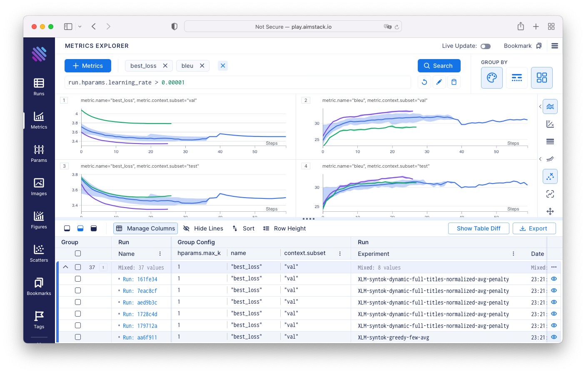

# Kedro Aim

[](https://badge.fury.io/py/kedro-aim)
[](https://pypi.org/project/kedro/)
[](https://kedro-aim.readthedocs.io/en/latest/?badge=latest)
[](https://opensource.org/licenses/MIT)
[](https://github.com/AnH0ang/kedro-aim/actions/workflows/publish.yml)
[](https://github.com/AnH0ang/kedro-aim/actions/workflows/testing.yml)
[](https://codecov.io/gh/AnH0ang/kedro-aim)
[](https://github.com/psf/black)

## 📝 Description

`kedro-aim` is a [kedro-plugin](https://kedro.readthedocs.io/en/stable/extend_kedro/plugins.html) that enables tracking of metrics and parameters with [Aim](https://aimstack.io/) from within Kedro.
Kedro is a great tool for data engineering and data science, but it lacks a clear way to track metrics and parameters.
Aim is a great tool for tracking metrics and parameters, but it lacks a clear way to integrate with Kedro.
This plugin aims to solve both problems.



## 🎖 Features

- Automatic Registration of Aim `Run` in Data Catalog
- Tracking of Artifact with Aim DataSet
- Configuration over `aim.yml`

## ⚙️ Installation

Install the package with `pip`:

```bash
pip install kedro-aim
```

## 💡 Usage Examples

The plugin automatically registers a [Run](https://aimstack.readthedocs.io/en/latest/refs/sdk.html#aim.sdk.run.Run) instance in the DataCatalog under the name `run` which can be accessed by all nodes to log metrics and parameters.
This run instance can be used track metrics and parameters in the same way as in any other [python project](https://aimstack.readthedocs.io/en/latest/quick_start/supported_types.html)

First you need to initilize the `aim.yml` config file inside your pre-existing Kedro project.
This can be done by running the following command:

```shell
kedro aim init
```

In order to use `aim` inside a node you need to pass the run object as a argument of the function.
Inside the function you can access the run object and use it to log metrics and parameters.

```python
# nodes.py
import pandas as pd
from aim import Run


def logging_in_node(run: Run, data: pd.DataFrame) -> None:
    # track metric
    run.track(0.5, "score")

    # track parameter
    run["parameter"] = "abc"
```

When defining the pipeline, you need to pass the `run` dataset as a input to the node.
The `run` dataset will be automatically created by `kedro-aim` and added to the DataCatalog.
As a result, the `run` dataset will be passed to the node as an argument.

```python
# pipeline.py
from kedro.pipeline import node, Pipeline
from kedro.pipeline.modular_pipeline import pipeline


def create_pipeline(**kwargs) -> Pipeline:
    return pipeline(
        [
            node(
                func=logging_in_node,
                inputs=["run", "input_data"],
                outputs=None,
                name="logging_in_node",
            )
        ]
    )
```

## 🧰 Config File

The module is configured via the `aim.yml` file which should be placed inside the `conf/base` folder.
A default config file can be generated using the `kedro aim init` command from the shell.

You can enable the schema validation in your VSCode IDE to enable real-time validation, autocompletion and see information about the different fields in your catalog as you write it. To enable this, make sure you have the [YAML plugin](https://marketplace.visualstudio.com/items?itemName=redhat.vscode-yaml) installed.
Then enter the following in your `settings.json` file:

```json
{
  "yaml.schemas": {
    "https://raw.githubusercontent.com/AnH0ang/kedro-aim/master/static/jsonschema/kedro_aim_schema.json": "**/*aim*.yml"
  }
}
```

## 🙏 Acknowledgement

This project was inspired by the work of [kedro-mlflow](https://github.com/Galileo-Galilei/kedro-mlflow) which is a plugin for Kedro that enables tracking of metrics and parameters with [MLflow](https://mlflow.org/) from within Kedro.
